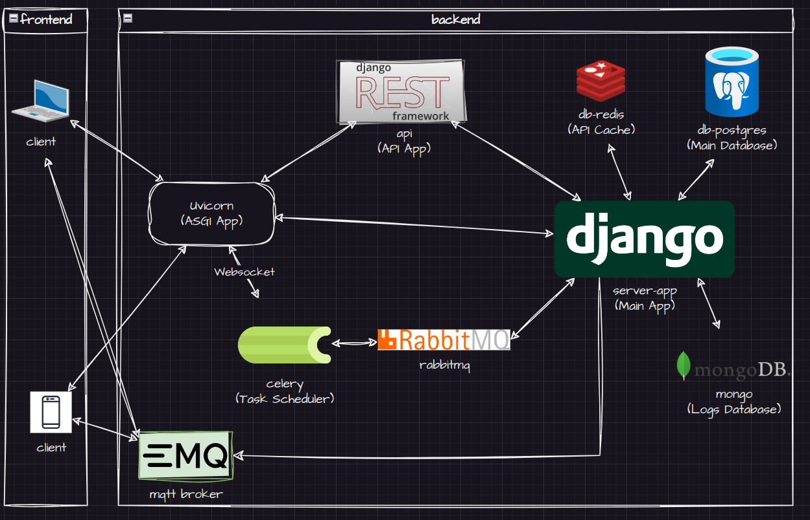

# Documentation

## Server App

### Architecture

### Models

- Entities
  - User (django default)
    - user_id (pk)
    - username
    - email
    - password
    - role                      # set of permissions
  - Log
    - log_id (pk)
    - log_level
    - message
    - created_at
    - device_id (fk)
  - Device
    - device_id (pk)
    - device_name
    - device_type
    - os_version
    - user_id (fk)              # device_user
  - Application
    - app_id (pk)
    - app_name
    - package_name
    - version
    - policy
